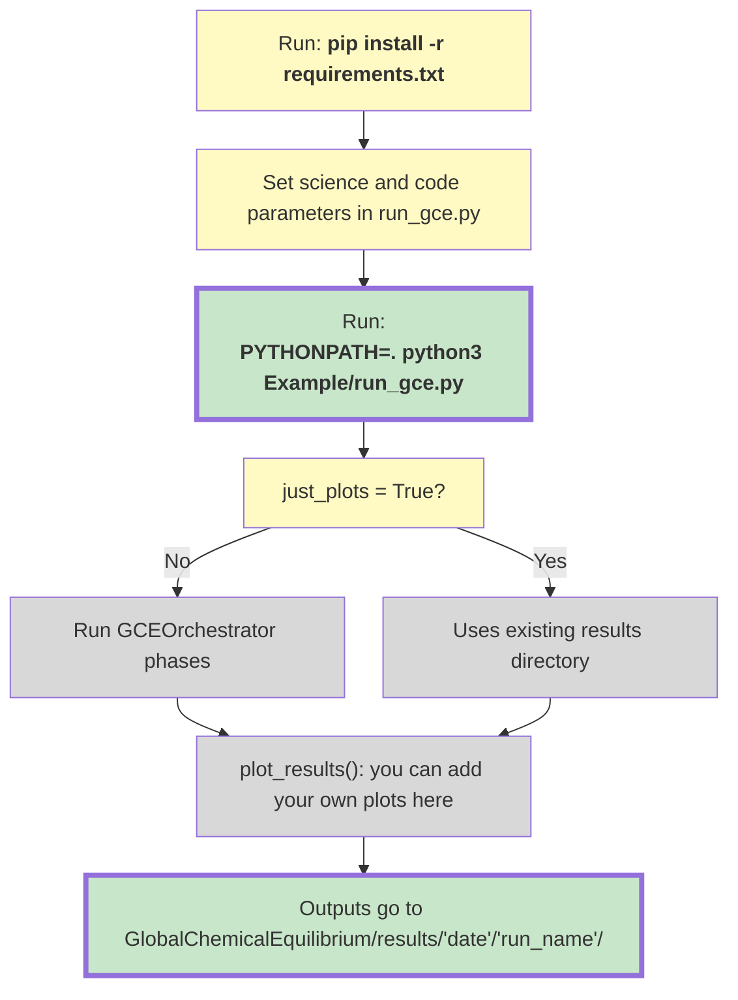

# How to run parameter studies #

## Python environment

From the **repository root** (`GlobalChemicalEquilibrium/`), install dependencies with pip (no `uv` required):

```
python3 -m venv .venv
source .venv/bin/activate
pip install --upgrade pip
pip install -r requirements.txt
```

The pinned list lives at [`requirements.txt`](../requirements.txt) in the repo root. The code imports packages such as `tools` from the repo root, so set `PYTHONPATH` to that directory when you run scripts (see below).

## Run instructions

From the **repository root**, run the full GCE pipeline with:

```
PYTHONPATH=. python3 Example/run_gce.py
```

Set any relevant parameters in `run_gce.py` (or in `create.py` if you use the older step-by-step flow below) before running.

### GCE Workflow



### What To Change In `run_gce.py`

Most users will only want to change these three things:
- `params`
  This is the main science control. It chooses the actual chemistry/planet parameter values or ranges to run.
  You set it with `GCEParams(...)` from [`gce_orchestrator.py`](/Users/annikasalmi/GlobalChemicalEquilibrium/Example/gce_orchestrator.py).
- `run_name`
  This is just the run name. It controls the name of the results folder so you can recognize the run later.
- `version`
  This chooses which solver/version directory to use, for example `Sulfur_Version`, `Carbon_Version`, or `Sulfur_Nitrogen_Version`.

The other controls are mostly run-management flags:
- `just_plots`
  If `False`, run the full pipeline from input generation through solving and plotting.
  If `True`, skip computation and only regenerate plots from an existing results/input directory.
- `plot_results_dir`
  Only matters when `just_plots=True`.
  This tells the code which existing run directory to read when you want to regenerate plots.
- `only_sulfur_plots`
  If `True`, limit the plot suite to the sulfur-focused plots.
  If `False`, also make the broader plot set.

### What `params` Means

`params` is the object that actually changes the science case being run.
In other words:
- `run_name` changes the folder name
- `version` changes which code version is used
- `params` changes the chemistry/planet setup itself

So if you are asking "what do I most likely want to modify for a new science run?", the answer is:
1. `params`
2. `run_name`
3. sometimes `version`

If you are only changing plotting or rerunning an old case, then you usually want:
1. `just_plots=True`
2. `plot_results_dir=...`

The pipeline performs, in order (unless `JUST_PLOTS` is True):
1) `create()` – generates inputs (respects `SULFUR` flag).
2) `copy_inputs()` – copies solver/param/Gibbs into each case.
3) `run_all()` – runs solver across cases (parallelized).
4) `find_min()` – finds best solutions.
5) `get_results()` – aggregates outputs.
6) `plot_results()` – writes plots to `input_Folder/plots/`.

Outputs (inputs, results, plots) are written under `input_Folder_{version}/`.

## Partial Melt ##

If you want to run the staged partial-melt workflow rather than the standard
full-melt pipeline, use [`run_partial_melt/README.md`](run_partial_melt/README.md).
That README includes a **layer diagram** and links to [`ARCHITECTURE.md`](run_partial_melt/ARCHITECTURE.md) for call order, module roles, and full-melt load vs rerun.

This workflow:
1. Uses a full-melt case and freezes the core.
2. Steps the silicate reservoir down in chained melt fractions.
3. Uses each solved state as the input for the next step.
4. Runs the reduced partial-melt solver in `results_partial/...`

### Version selection

- `version` should match an existing version directory (e.g., `Sulfur_Version`, `Carbon_Version`).
- The pipeline uses that directory’s solver, `param.dat`, `chem_input.dat`, and `Gibbs.dat`.
- Sulfur is enabled automatically when `version` contains `Sulfur_Version`; otherwise sulfur is off.

`run_gce.py` now checks the selected version directory with `make` before any non-plotting run, so switching versions or changing solver-side source in that version is picked up automatically.

### Main GCE Files

- [`run_gce.py`](/Users/annikasalmi/GlobalChemicalEquilibrium/Example/run_gce.py)
  Public entrypoint. This is the small user-facing script to run or replot a full GCE study.
- [`gce_orchestrator.py`](/Users/annikasalmi/GlobalChemicalEquilibrium/Example/gce_orchestrator.py)
  Workflow/orchestration layer. It owns the build check, input-directory setup, solver execution, and plotting phases.

Otherwise, can be run with the following steps:

## Step 1 ##

 - Set parameters ranges in the 'create.py' file.

 - Run with:
	
	python3 create.py

This will create the following things:

 - A new folder with the name specified in the file 'create.py'.
 - A subfolder for all cases with the needed input files.
 - A file 'parametersAll.dat' with a summary of all chemical input parameters. 
 - A file 'summary_chem_input_GEC.csv' with the summary of all other parameters.


## Step 2 ##

Compile the code and copy the executable 'solver' (name may change in the future) into the 'Examples' folder.

## Step 3 ##

Modify the param.dat file if necessary.

Check if the path to the 'Gibbs.py' file is correct

## Step 4 ##

Copy the param.dat file and the executable to the subfolder with:

	python3 copyToInput.py

## Step 5 ##

Run the code in all subfolers with:

	python3 runAll.py

## Step 6 ##

Find the best solution of the solver with:

	python3 findMin.py

This will create two new files in 'input_Folder':

 - chi.dat contains for each subfolder the minimal chi^2 value
 - min.dat contains the corresponding line of the 'output' file from the subfolders.

## Step 7 ##

Collect all data with:

	python3 get_Results.py

This will create a new file called 'results.dat' in 'input_Folder'. 

The files contain all used parameters, results and other quantities that can be used for further analysis or plotting.
