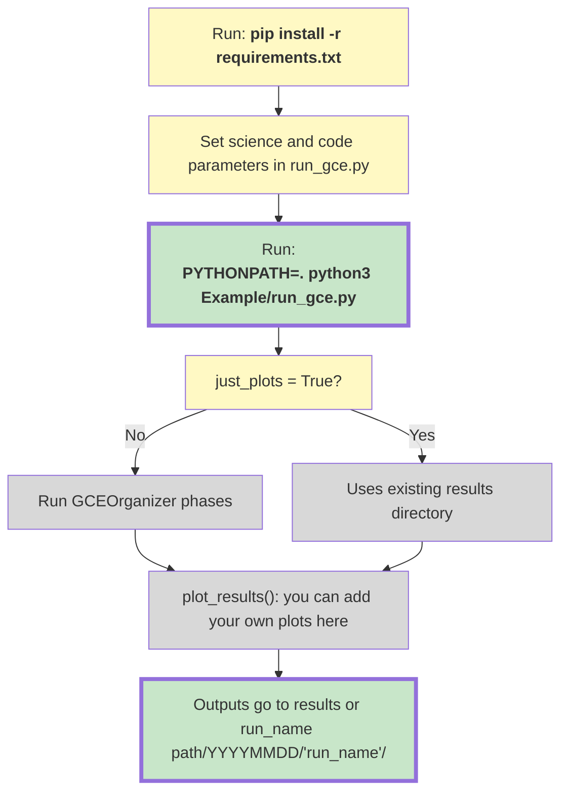

# GCE Workflow Diagram

```mermaid
---
config:
  layout: dagre
  flowchart:
    nodeSpacing: 30
    rankSpacing: 30
---
flowchart TB
    A1["Run: <b>pip install -r requirements.txt"] --> A
    A["Set science and code parameters in run_gce.py"] --> B["Run:<b><br>PYTHONPATH=. python3 Example/run_gce.py"]
    B --> n1["just_plots = True?"]
    n1 -- Yes --> J["Uses existing results directory"]
    n1 -- No --> D["Run GCEOrganizer phases"]
    D --> I["plot_results(): you can add your own plots here"]
    J --> I
    I --> K@{ label: "Outputs go to results or run_name path/YYYYMMDD/'run_name'/" }
    style A fill:#FFF9C4
    style A1 fill:#FFF9C4
    style B fill:#C8E6C9,stroke-width:4px
    style n1 fill:#FFF9C4
    style J fill:#d8d8d8
    style D fill:#d8d8d8
    style I fill:#d8d8d8
    style K stroke-width:4px,fill:#C8E6C9
```
