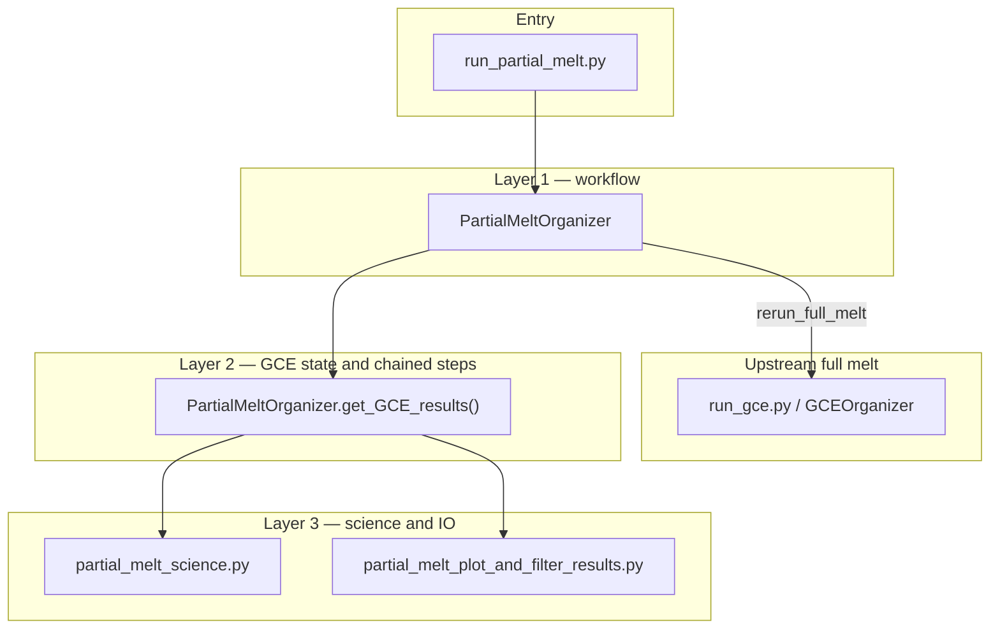

# Partial-Melt Architecture

## File Roles

- [`run_partial_melt.py`](run_partial_melt.py) is the public entry point. It
  decides whether to replot, rerun the upstream full-melt case, load an existing
  full-melt directory, build the solver, and execute the chain.
- [`partial_melt_organizer.py`](partial_melt_organizer.py) owns the
  workflow phases, `PartialMeltParams`, full-melt state loading, chain
  directory creation, per-step solving, and postprocessing calls.
- [`partial_melt_science.py`](partial_melt_science.py) owns the science/state
  transforms: melt-fraction schedules, frozen-core bookkeeping, active silicate
  mass calculations, pressure calculation, and melt-versus-solid splitting.
- [`partial_melt_plot_and_filter_results.py`](partial_melt_plot_and_filter_results.py)
  rebuilds per-step and chain-level tables, normalizes solver outputs into the
  plotting schema, and reruns the partial-melt plotting suite.

## Layer Diagram

How the partial-melt code is stacked: entry script, workflow phases,
GCE-state/chain organizer, then science and per-step I/O. Upstream full melt is
optional when `rerun_full_melt=True`.

