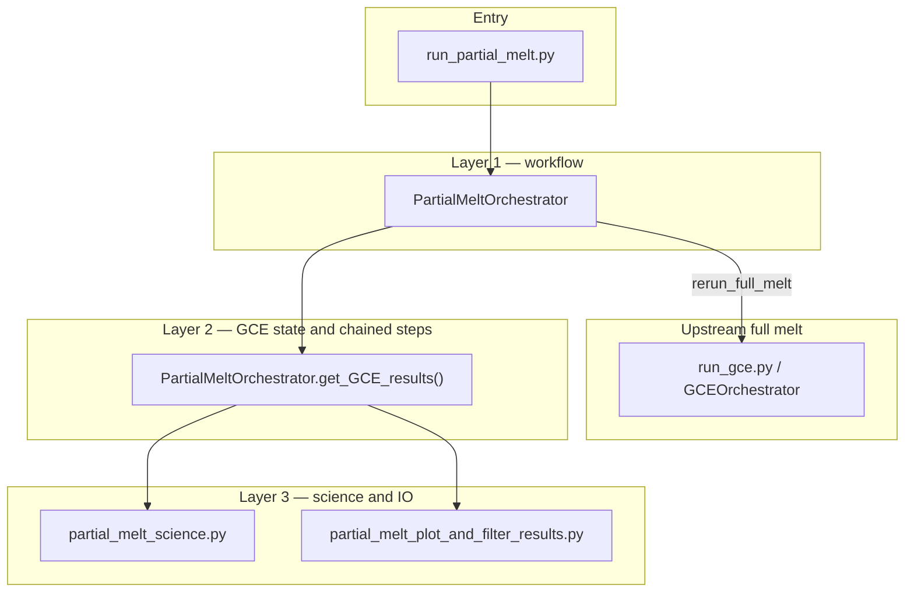
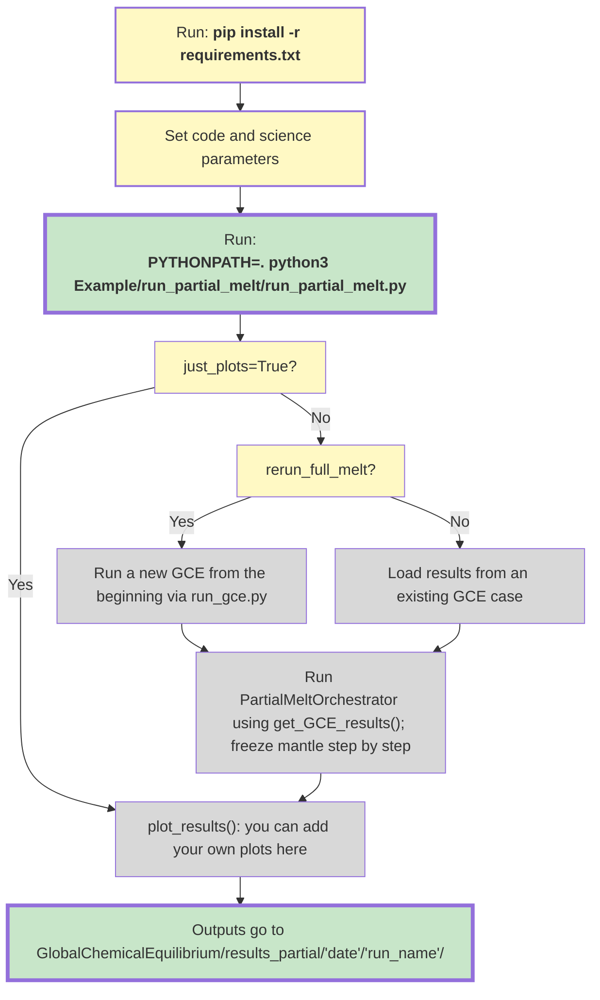

# Partial Melt Workflow

Use [`run_partial_melt.py`](run_partial_melt.py) for the partial-melt workflow in this repository. 
This workflow takes a full-melt GCE case, freezes the core, and slowly solidifies the mantle,
solving the new equilibrium at each step along the way.

For **call order**, **which file owns I/O vs science vs plotting**, and **`rerun_full_melt` vs loading an existing full-melt directory**, see [`ARCHITECTURE.md`](ARCHITECTURE.md).

### Python environment

From the **repository root** (`GlobalChemicalEquilibrium/`), install dependencies with pip:

```
python3 -m venv .venv
source .venv/bin/activate
pip install --upgrade pip
pip install -r requirements.txt
```

The pinned list is [`requirements.txt`](../../requirements.txt) at the repo root. Imports such as `tools` and `Example` expect the repo root on `PYTHONPATH`; when running from a terminal, use e.g. `PYTHONPATH=.` with paths relative to that root (see the VS Code launch configs under `.vscode/` for `PYTHONPATH`).

### Run instructions

From the **repository root**, run the partial-melt workflow with:

```
PYTHONPATH=. python3 Example/run_partial_melt/run_partial_melt.py
```

For the standard full-melt GCE pipeline only (no partial melt), use `PYTHONPATH=. python3 Example/run_gce.py` — see [`Example/README.md`](../README.md).

### Layer diagram

How the partial-melt code is stacked: entry script, workflow phases, GCE-state/chain organizer, then science and per-step I/O. Upstream full melt is optional when `rerun_full_melt=True`.



### Partial-Melt Workflow


Outputs are written under `results_partial/.../<prefix>_partial_melt`.

### Freeze Bookkeeping Logic

Take initial composition and freeze core. Then freeze a given percentage (`f_melt_step`) of the silicate based on the original amount of melt in the initial GCE. Rebalance melt and gas and repeat until only 5% melt.

Clarification:
`M_silicate_ref` is always the original silicate melt mass after the initial GCE state and core freeze. It does not get redefined after melt-gas rebalancing.

Ex: Start with original silicate melt mass `M_silicate_ref = 100`. First, we freeze 5%.
Now rebalance melt and gas.
We may now have a varying mass of silicate such as 94 or 89, as the rebalancing no longer has a core.
Either way, we now freeze 5% more of original mass, so we now have 10% solid.
Repeat.

### What To Change In `run_partial_melt.py`

Most users will only want to change these three things:
- `params`
  This is the main science control for the partial-melt run.
  It determines the full-melt starting state, the partial-melt stepping behavior, and the GCE-state assumptions.
- `run_name`
  This is the run name.
  It controls the name of the partial-melt results folder so you can recognize the run later.
- `just_plots`
  Only change this when you want to skip computation and regenerate plots from an existing partial-melt results directory.

The other run-management control is:
- `plot_results_dir`
  Only matters when `just_plots=True`.
  This tells the code which existing partial-melt results directory to use for replotting.
- `full_melt_results_dir`
  Path to an already-completed full-melt run to use as the starting state.
- `version_full_melt`
  Which full-melt code version to use upstream.

Other useful controls:
- `f_melt_step`
  Controls the schedule resolution.
  If you want an extra near-initial point such as `f_melt=0.99` or `f_melt=0.01`, use a smaller step size that explicitly includes it.
- `refractory_gas_to_mantle`
  If `True`, uses the dedicated `No_Refractory_Gas_Version` partial-melt solver, which excludes `Fe_gas`, `Mg_gas`, `Na_gas`, `SiO_gas`, and `SiH4_gas` from the active atmospheric network.
- `volatile_retention_in_solid`
  If `False`, volatile silicate species stay in the melt rather than freezing into the solid.
- `freeze_solid`
  If `True`, the active melt reservoir shrinks through the chain.
  If `False`, the run keeps solving without freezing out additional silicate.
- `rerun_full_melt`
  If `True`, rerun the upstream full-melt GCE case instead of reusing an existing one.

**What each file is for**

- [`run_partial_melt.py`](run_partial_melt.py)
  Public entrypoint. Use this file if you just want to run the workflow or regenerate plots.
  It also auto-detects whether the compiled solver matches the requested mode and rebuilds when necessary.
- [`partial_melt_orchestrator.py`](partial_melt_orchestrator.py)
  Workflow/orchestration layer for the partial-melt run phases that sit underneath `run_partial_melt.py`.
- [`partial_melt_params.py`](partial_melt_params.py)
  User-facing run parameters.
- [`partial_melt_orchestrator.py`](partial_melt_orchestrator.py)
  Defines **`get_GCE_results()`**: the full-melt to partial-melt GCE-state builder.
  It loads the solved full-melt case, applies the partial-melt GCE-state rules, computes the schedule, and writes the initial GCE-state records; `PartialMeltOrchestrator` also owns the explicit `f_melt=1` seed step and all later per-step solve/postprocess methods.
- [`partial_melt_plot_and_filter_results.py`](partial_melt_plot_and_filter_results.py)
  Step table-shaping, filtered results assembly, and postprocessing after the run.
  It writes per-step metadata files, normalizes the seed and solved-step outputs into the standard plotting schema, builds the partial-melt `results.dat` table from solver outputs, reconstructs the top-level chain tables from saved `step_f*` folders, and reruns the plotting suite.
- [`partial_melt_science.py`](partial_melt_science.py)
  Science/state-transformation logic.
  It owns melt-fraction schedules, frozen-core bookkeeping, active silicate mass calculations, and the melt-versus-solid split for each chained step.

**Typical usage**

```python
from Example.run_partial_melt.partial_melt_params import PartialMeltParams
from Example.run_partial_melt.run_partial_melt import run_partial_melt

run_partial_melt(
    params=PartialMeltParams(
        f_melt_stop=0.05,
        f_melt_step=0.1,
    ),
    run_name="test4",
)
```

**Replotting only**

Set `just_plots=True` and pass `plot_results_dir` to rebuild plots for an existing partial-melt results directory.

```python
run_partial_melt(
    params=PartialMeltParams(),
    run_name="unused_when_just_plotting",
    just_plots=True,
    plot_results_dir="results_partial/apr02/test4_partial_melt",
)
```
