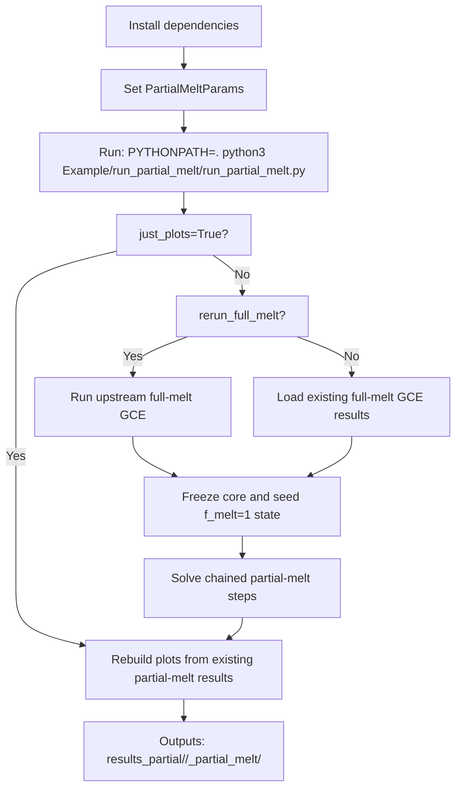

# Partial-Melt Workflow Diagram

```mermaid
---
config:
  layout: dagre
  flowchart:
    nodeSpacing: 30
    rankSpacing: 30
---
flowchart TB
    A1["Install dependencies"] --> X1
    X1["Set PartialMeltParams"] --> A["Run: PYTHONPATH=. python3 Example/run_partial_melt/run_partial_melt.py"]
    A --> B["just_plots=True?"]
    B -- Yes --> M["Rebuild plots from existing partial-melt results"]
    B -- No --> C["rerun_full_melt?"]
    C -- Yes --> D["Run upstream full-melt GCE"]
    C -- No --> E["Load existing full-melt GCE results"]
    D --> F["Freeze core and seed f_melt=1 state"]
    E --> F
    F --> G["Solve chained partial-melt steps"]
    G --> M
    M --> P["Outputs: results_partial/<date>/<run_name>_partial_melt/"]
```
